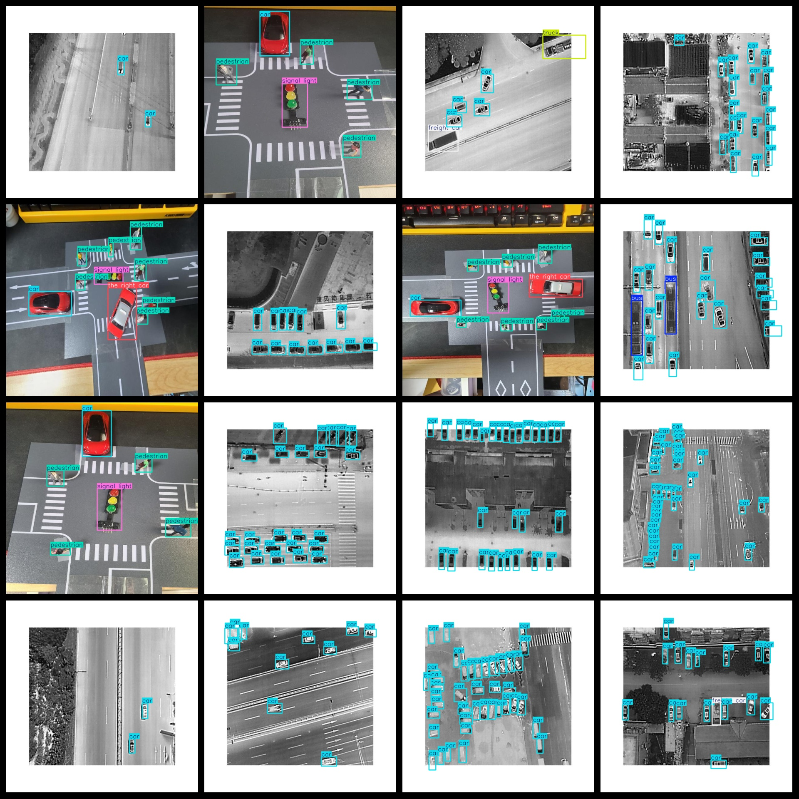
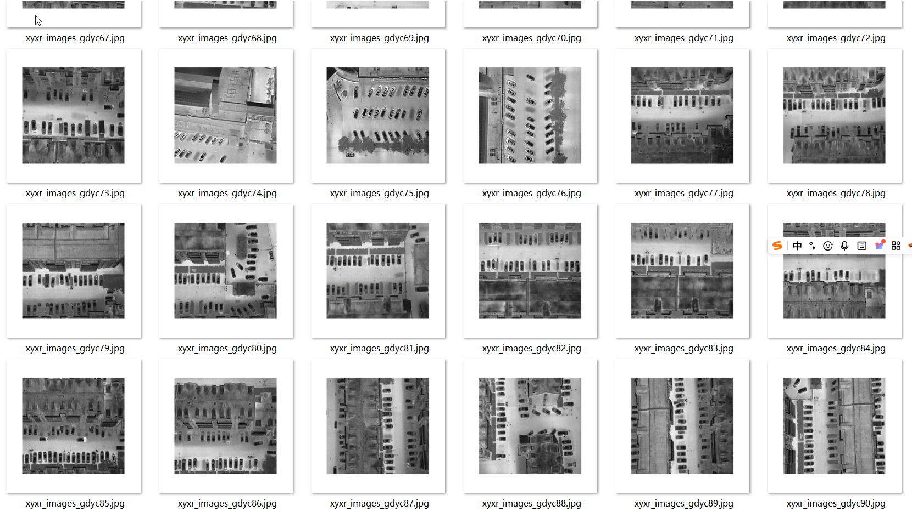

# Aerial transport Target Detection Dataset 9809 imagesVOC+YOLO format

Aerial traffic target detection dataset 9809 VOC + YOLO format

Dataset Format: VOC format + YOLO format

The compressed file contains: three folders, each storing images, xml files, and text files.

Total jpg images in JPEGImages folder: 9809

The total number of XML files in the Annotations folder is 9809.

The total number of txt files in the labels folder: 9809.

Number of tag types: 10

Tag names: ["bus","car","freight car","pedestrian","people","signal light","the right car","truck","undefined","van"]

The number of boxes for each label (Note that the order of labels in the Yolo format does not correspond to this, but is based on the classes.txt file in the labels folder):

bus frame count = 5241

car frame count = 121532

freight car frame count = 4815

pedestrian frame count = 7682

people frame count = 653

signal light frame count = 1704

the right car frame count = 667

truck frame count = 7161

undefined frame count = 6

van frame count = 3463

Total boxes: 152924

Picture clarity (Resolution: Pixels): Clear

Image Enhancement: Yes

Shape of the label: Rectangular box, used for object detection and recognition.

Important Note: None

Special Notice: This dataset does not guarantee the accuracy or precision of the trained models or weight files. The dataset only provides accurate and reasonable annotations.

Annotation and image details are as follows:

## Images

---

Here is a pay link on Stripe (https://buy.stripe.com/3cs8yP7sY87d0vu9AB). Please contact me lonlonago@foxmail.com after funding $89, and I will send you a complete data files, thank you!

